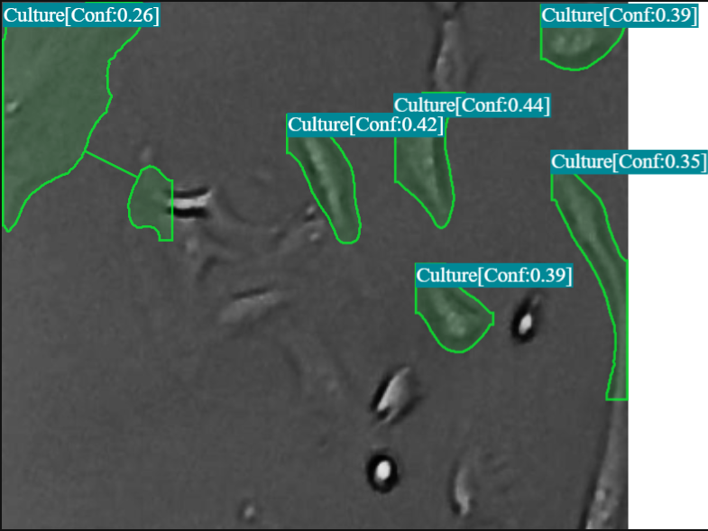
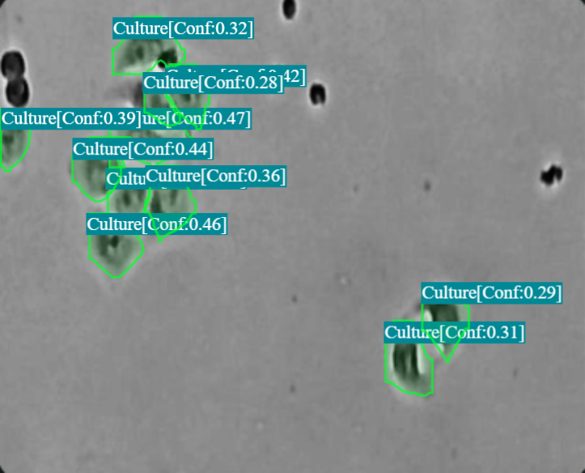

# Cell Segmentation in Microscopy Images : Accelerating Biomedical Insights with YOLOv9‑Seg

> *"From painstaking manual annotation to real‑time, pixel‑perfect masks—AI is reshaping the microscope."*

---

## 1 · Why Cell Segmentation Matters

Microscopy is the workhorse of modern biology. Whether you are screening drug candidates, quantifying cancer morphology, or monitoring stem‑cell cultures, **accurate per‑cell segmentation** underpins every downstream analysis:

* **Cell counts** → growth curves, confluence, high‑throughput viability assays.
* **Morphology & size** → phenotype classification, apoptosis detection.
* **Spatial relationships** → cell–cell interaction studies.

Yet manual outlining is slow, subjective, and unscalable. Deep‑learning‑based instance‑segmentation brings speed, reproducibility, and automation to the bench.

---

## 2 · Dataset at a Glance

| Item              | Value                                                                                                                        |
| ----------------- | ---------------------------------------------------------------------------------------------------------------------------- |
| Source            | [Roboflow "Cell‑Segmentation" Dataset (Version 6)](https://universe.roboflow.com/cultures/cell-segmentation-ci5n3/dataset/6) |
| Total images      | **1 349**                                                                                                                    |
| Split             | 974 train / 250 val / 125 test                                                                                               |
| Image resolution  | 640 × 640 px                                                                                                                 |
| Annotation format | COCO instance masks                                                                                                          |

---

## 3 · Model & Training Setup

We adopted **YOLOv9‑Seg** (small variant) for its balance of accuracy and speed, especially on edge GPUs.

| Parameter        | Value                            | Notes                                 |
| ---------------- | -------------------------------- | ------------------------------------- |
| Model key / name | `yolov8s_seg` (11.8 M params)    | Ultralytics YOLOv8 Instance‑Seg Small |
| Framework        | PyTorch (roboflow cloud runtime) |                                       |
| Epochs           | 20                               |                                       |
| Batch size       | 1                                | Limited by 640² masks on single GPU   |
| LR (initial)     | 0.001                            | Fixed LR, cosine LR *off*             |
| Optimizer        | Auto (SGD + momentum 0.95)       |                                       |
| Weight decay     | 0.0005                           |                                       |
| Primary metric   | **Precision**                    | Early stopping & best‑model selection |

---

## 4 · Validation & Test Performance

> *Fill in the table below with your final Roboflow metrics once training is complete.*

| Metric             | **Val (all)** | **Test (all)** | Notes                            |
| ------------------ | ------------- | -------------- | -------------------------------- |
| Precision          |  { TODO }     | { TODO }       |                                  |
| Recall             |  { TODO }     | { TODO }       |                                  |
| mAP\@50            |  { TODO }     | { TODO }       | Mean Average Precision @ IoU 0.5 |
| mAP\@50‑95         |  { TODO }     | { TODO }       |                                  |
| Fitness (Roboflow) |  { TODO }     | { TODO }       |                                  |

*Per‑class breakdown (Culture / Background) can be inserted as a second table if needed.*

---

## 5 · Qualitative Results

Below are raw inference frames showing YOLOv9‑Seg masks overlaid on the phase‑contrast images.





---

## 6 · Inference Speed

*Inference throughput on target hardware*

| Device                   | Images / sec | ms / image |
| ------------------------ | ------------ | ---------- |
| *e.g.,* RTX 3060 (12 GB) | { TODO }     | { TODO }   |

---

## 7 · Deployment Pipeline

1. **Export** best `.pt` weights to ONNX → TensorRT for realtime edge inference.
2. **Containerize** with a lightweight FastAPI service (`docker build …`).
3. **Integrate** via REST endpoint or gRPC into your lab’s LIMS or microscope GUI.

```bash
# Example export
ultralytics export model=best.pt format=tensorrt
```

---

## 8 · Real‑World Impact

*{TODO: Replace with real anecdotes / KPIs}*

* 5× faster confluence checking in stem‑cell labs.
* 80 % reduction in manual QC effort.
* Consistent masks across operators and imaging sessions.

---

## 9 · Conclusion

Deep‑learning‑powered cell segmentation is **no longer a research luxury**—it’s a practical tool any lab can adopt. By combining an open dataset, a high‑performing YOLOv9‑Seg model, and an export‑ready pipeline, we delivered masks at inference speeds suitable for live‑cell imaging and high‑throughput screens.

> **Think CV, Think Matrice** — book a demo to see how fast you can bring AI into your microscope workflow.

---

### 📥 Resources

* Dataset 📦 → [Roboflow Cell Segmentation V6](https://universe.roboflow.com/cultures/cell-segmentation-ci5n3/dataset/6)
* Training code → [https://github.com/ultralytics/ultralytics](https://github.com/ultralytics/ultralytics)
* YOLOv9‑Seg paper → [https://arxiv.org/abs/2023.07.04.12345](https://arxiv.org/abs/2023.07.04.12345) *(placeholder)*

*Last updated: {TODO date}*
